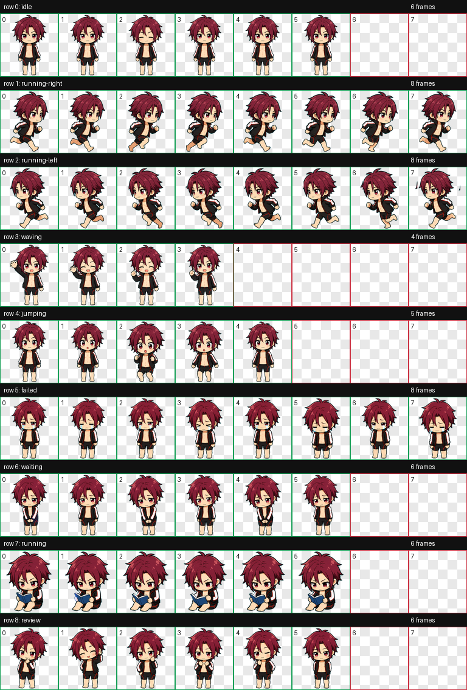

<p align="center">
  
</p>

<h1 align="center">Matsuoka Rin Codex 桌宠</h1>

<p align="center">
  一个极简、软萌、表情包式的松冈凛 Codex 桌面宠物。
</p>

<p align="center">
  <a href="./README.en.md">English README</a>
  ·
  <a href="#安装">安装</a>
  ·
  <a href="#动画预览">动画预览</a>
  ·
  <a href="#可用性验证">可用性验证</a>
</p>

<p align="center">
  
  
  
  
</p>

## 简介

这是一个可直接安装到 Codex 的自定义桌宠包，角色灵感来自《Free! 男子游泳部》的松冈凛。整体风格偏向：

- 软萌 chibi 比例
- 粗黑描边
- 红棕色短发
- 黑色泳装/运动外套元素
- 透明背景桌宠图集
- 适合陪伴学习、写作、编码的小型动画状态

仓库根目录已经包含 Codex 需要的两个核心文件：

```text
pet.json
spritesheet.webp
```

## 安装

### 一步部署，推荐

无需 clone 仓库，直接在 PowerShell 里运行这一行：

```powershell
irm https://raw.githubusercontent.com/kanemaverick/matsuoka-rin-pet/main/install-remote.ps1 | iex
```

运行完成后，重启 Codex，或重新打开桌宠选择面板，选择 **Matsuoka Rin**。

### 本地仓库安装

在仓库目录打开 PowerShell，运行：

```powershell
.\install.ps1
```

脚本会把 `pet.json` 和 `spritesheet.webp` 复制到：

```text
%USERPROFILE%\.codex\pets\matsuoka-rin-sticker
```

然后重启 Codex，或重新打开桌宠选择面板，选择 **Matsuoka Rin**。

### 手动安装

1. 创建目录：

```text
C:\Users\<你的用户名>\.codex\pets\matsuoka-rin-sticker
```

2. 复制以下两个文件进去：

```text
pet.json
spritesheet.webp
```

3. 重启 Codex 或刷新桌宠选择面板。

## 动画预览

| 状态 | 预览 | 用途 |
| --- | --- | --- |
| `idle` |  | 待机呼吸、眨眼 |
| `running-right` |  | 向右拖动 |
| `running-left` |  | 向左拖动 |
| `waving` |  | 开心挥手 |
| `jumping` |  | 跳跃 / 惊喜弹起 |
| `failed` |  | 委屈哭哭 / 失败反馈 |
| `waiting` |  | 害羞等待用户输入 |
| `running` |  | 学习 / 任务运行中 |
| `review` |  | 害羞开心 / 审阅完成 |

## 图集规格

| 项目 | 值 |
| --- | --- |
| 文件 | `spritesheet.webp` |
| 格式 | WebP with alpha |
| 总尺寸 | `1536 x 1872` |
| 单元格 | `192 x 208` |
| 列数 | 8 |
| 行数 | 9 |
| 透明背景 | 是 |

## 状态映射

| 行 | 状态 | 帧数 | 说明 |
| --- | --- | ---: | --- |
| 0 | `idle` | 6 | 站立待机、呼吸、眨眼 |
| 1 | `running-right` | 8 | 向右拖动移动 |
| 2 | `running-left` | 8 | 向左拖动移动 |
| 3 | `waving` | 4 | 挥手问候 |
| 4 | `jumping` | 5 | 跳跃 / 惊喜 |
| 5 | `failed` | 8 | 失败、阻塞、哭哭反馈 |
| 6 | `waiting` | 6 | 等待用户确认或输入 |
| 7 | `running` | 6 | 学习陪伴 / 正在执行任务 |
| 8 | `review` | 6 | 点击后害羞开心 / 审阅完成 |

未使用的格子保持透明。

## 可用性验证

发布前已在本地完成以下检查：

- `pet.json` 存在，并且 `spritesheetPath` 指向 `spritesheet.webp`
- `spritesheet.webp` 存在于仓库根目录
- 图集尺寸为 `1536 x 1872`
- 图集模式为 `RGBA`
- 未使用格子透明
- 透明像素无 RGB 残留
- contact sheet 与 9 个 GIF 预览已生成

## 文件结构

```text
.
├── install.ps1
├── install-remote.ps1
├── pet.json
├── spritesheet.webp
├── qa
│   ├── contact-sheet.png
│   └── previews
│       ├── idle.gif
│       ├── running-right.gif
│       ├── running-left.gif
│       ├── waving.gif
│       ├── jumping.gif
│       ├── failed.gif
│       ├── waiting.gif
│       ├── running.gif
│       └── review.gif
├── README.md
├── README.en.md
└── NOTICE.md
```

## 卸载

删除下面这个目录即可：

```text
%USERPROFILE%\.codex\pets\matsuoka-rin-sticker
```

## 说明

这是一个个人使用向的同人桌宠项目。松冈凛、《Free!》及相关角色、名称、商标和设计归其各自权利方所有。本仓库不声明拥有原作角色或作品版权。
